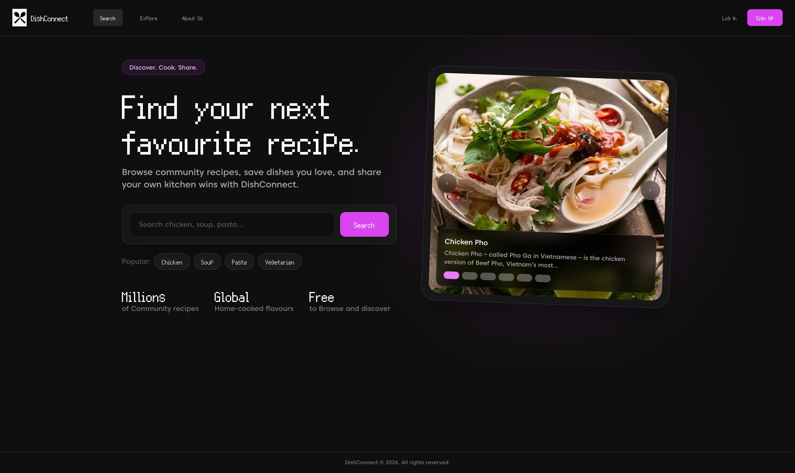

# DishConnect

DishConnect is a community recipe-sharing web app where users can discover recipes, upload their own dishes, and save favourites.



## Features

- **Recipe discovery:** Search and browse community recipes.
- **Recipe uploads:** Share recipes with images, ingredients, steps, and cooking times.
- **User accounts:** Sign in and manage personal recipe activity.
- **Favourites:** Save recipes to revisit later.
- **Responsive design:** Built for desktop and mobile browsing.

## Tech Stack

- **Frontend:** React, Vite, Tailwind CSS
- **Routing:** React Router
- **Backend services:** Supabase
- **Deployment:** Vercel

## Getting Started

Install dependencies:

```bash
npm install
```

Start the development server:

```bash
npm run dev
```

Build for production:

```bash
npm run build
```

## Environment Variables

Create a `.env` file with the required Supabase configuration values before running the app locally.
